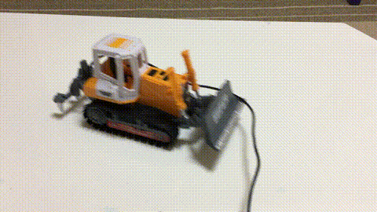
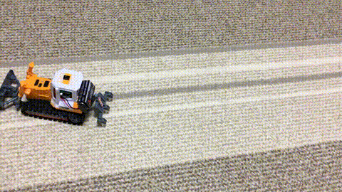

## Description

IrDA Bulldozer aims to control toys via IrDA communication. To achieve that, minimize the cost of devices.

## Parts

+ Bulldozer: [Toy bulldozer](https://www.amazon.co.jp/%E3%83%95%E3%82%A1%E3%83%BC%E3%82%B9%E3%83%88%E3%83%BB%E3%82%A2%E3%83%AD%E3%83%BC-FIRST-ARROW-201-180-%E3%83%AA%E3%83%A2%E3%82%B3%E3%83%B3%E3%83%96%E3%83%AB%E3%83%89%E3%83%BC%E3%82%B6%E3%83%BC/dp/B01AW52W62)
+ Micro controller: [Microchip(Atmel) ATtiny85](https://www.microchip.com/wwwproducts/en/ATtiny85)
+ GPIO expander: [Microchip MCP23017](https://www.microchip.com/wwwproducts/en/MCP23017)
+ IrDA receiver: [SPS-448-1](http://akizukidenshi.com/catalog/g/gI-00872/)
+ IrDA controller: [OE13KIR](http://akizukidenshi.com/catalog/g/gM-07245/)
+ Motor driver: [TB6612](http://akizukidenshi.com/catalog/g/gK-11219/)
+ Regulator : [TA48M05F](http://akizukidenshi.com/catalog/g/gI-00451/)
+ Registers (4.7kohm * 2, 20kohm * 2)
+ Capacitors (0.1uF * 2)

## Sample
### Before

### After

